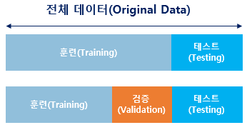

# 머신러닝 워크 플로우
## 1. 머신러닝 워크플로우
- 머신러닝의 워크 플로우는 크게 6가지로 나누면 아래와 같다면
 

  1. 수집
     - 자연어 처리의 경우 자연어 데이터를 코퍼스(조사나 연구 목적에 의해 특정 도메인으로부터 수집된 텍스트 집합, html, csv, txt 파일 등)라 부름

  2.  점검 및 탐색
      - 데이터의 구조, 노이즈 데이터, 머신러닝 적용을 위해서 데이터를 어떻게 정제해야하는지 등을 파악
      - 탐색적 데이터 분석(Exploratory Data Analysis, EDA) 단계라고도 부름
      - 이는 독립 변수, 종속 변수, 변수 유형, 변수의 데이터 타입 등을 점검하며 데이터의 특징과 내재하는 구조적 관계를 알아내는 과정을 의미
      - 이 과정에서 시각화와 간단한 테스트를 진행

  3. 전처리 및 정제
     - 자연어처리 인 경우 토큰화, 정제 정규화 불용어 제거 등의 단계를 포함
 
  4. 모델링 및 훈련
     - 적절한 머신러닝 알고리즘을 선택하여 모델링
     - 전처리 완료 된 데이터를 머신러닝 알고리즘을 통해 기계에 학습(훈련 이라고도 함)
     - 기계가 훈련이 제대로 되었다면 그 후 기계는 우리가 원하는 Task인 기계 번역, 음성 인식, 텍스트 분류 등의 자연어 처리 작업을 수행
     - 실제 훈련 데이터는 전체 데이터를 전부 사용하지 않고 일부는 테스트용 데이터로 남겨두고 훈련용 데이터만 훈련에 사용해야 함
     - 그래야 기계가 학습 후 현재 성능을 측정 가능하며 과적합(overfitting)상황을 막을 수 있음
     - 데이터가 많다면 훈련, 테스트, 검증 데이터로 나누고 훈련용 데이터만 사용하기도 함
    
     - 검증 데이터 : 기계가 훈련용 데이터로 얼마나 제대로 학습이 되었는지 판단과 모델의 성능 개선에 사용
     - 테스트 데이터 : 모델의 성능을 수치화하여 평가하기 위해 사용
     
  5. 평가
     - 기계가 학습이 되었다면 테스트용 데이터로 성능을 평가
     - 평가 방법은 기계가 예측한 데이터가 테스트용 데이터에 얼마나 근접한지 측정
  
  6. 배포
     - 완성된 모델이 배포되는 단계
     - 완성된 모델에 대한 전체적인 피드백에 대해 모델의 변경사항 발생시 처음부터 재시작